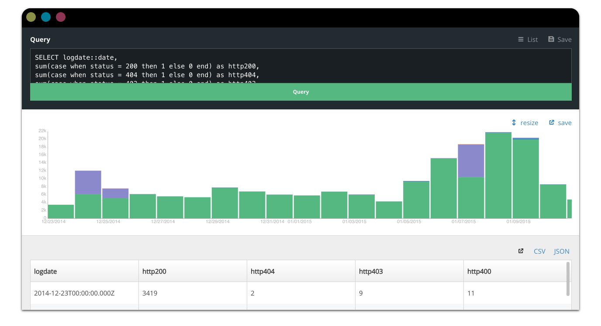

# stickshift

A clean & modern data interface: SQL queries into JSON, CSV, and charts,
done simply.



## Features

* **Export** query results to JSON & CSV
* **Visualize** some query results automatically
* **Share** and save queries
* **Responsive** on lil' screens

## Installation

To run the simple demo:

```sh
$ npm install
$ npm start
```

Open up `http://localhost:3000/` and play around: the testing server
creates two tables:

**`fake`: random time-series data**

```sql
select * from fake;
```

**`cats`: random categorical data**

```sql
select * from cats;
```

Then you can configure the server by editing configuration in [site.js](site.js).

The example in [example_server.js](example_server.js) talks to SQLite,
but you can swap in Postgres/RedShift using the `pg` module,
MySQL using the `mysql` module, and so on. Or you can even just point
stickshift at any URL that accepts queries over POST and returns
results as JSON.

## Configuration

Stickshift exposes a JavaScript API of the form:

```js
var Stickshift = require('stickshift');

Stickshift(element, {
    // the http(s) endpoint to POST queries to and get results back
    endpoint: '',

    // GitHub access_token, used for saving queries
    token: '',
    // GitHub username, repo, and branch for saving queries.
    username: '',
    repo: '',
    branch: ''
});
```

Calling `Stickshift` props up the full interface and router within the given
element.

## Architecture

`stickshift` is built with [React](http://facebook.github.io/react/),
[Flux](https://facebook.github.io/flux/),
and [React-Router](https://github.com/rackt/react-router). It's written
in CommonJS & ES6 and cross-compiled with [browserify](http://browserify.org/)
& [6to5](https://6to5.org/). Query storage is powered by [hubdb](http://github.com/mapbox/hubdb).

Structure:

* `src/components`: UI components, like the chart, table, and query interface
* `src/stores`: Flux stores for saved queries & transient table information
* `src/constants`: Constants for actions, like 'received table results'
* `lib/` d3 & vega, for now, until [vega builds are sorted](https://github.com/trifacta/vega/issues/235)

## Bring your own auth

There's no user login system built into `stickshift`: like your choice of
database, this is likely to be specific to your purpose, company, usage,
and so on. Some common approaches include:

* Running it locally or behind a firewall
* Ditching `example_server.js` and integrating with a server that does
  authentication, like through passport. This is what we do at Mapbox.

If you run this on anything but a `localhost`, it's really best practice
to **create a read-only user**, since this is an interface for doing analysis
that should not have permissions to modify data.

## Charts

Stickshift automatically creates charts for applicable queries: those
that

* Have at least one column that is parseable as numbers.

The supported chart types are:

* **Time series**
  * Lines
  * Stacked bars
* **Categorical**
  * Grouped bars

These charts are rendered with [Vega](https://github.com/trifacta/vega).
They're designed for exploratory data analysis, so are relatively simple.

## Development

* Run `npm run develop` to continously rebuild source and run Stickshift
  without a node server.

## See Also

* [re:dash](https://github.com/EverythingMe/redash) is a similar open source project
